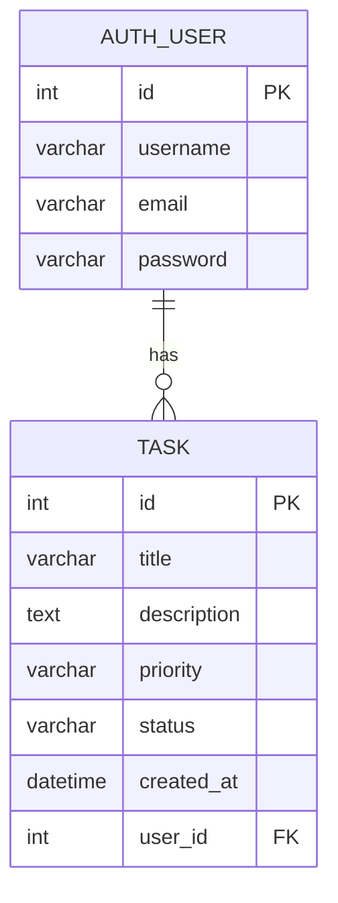

# Database ERD

```mermaid
erDiagram
    AUTH_USER ||--o{ TASK : "has"
    AUTH_USER {
        int id PK
        varchar username
        varchar email
        varchar password
    }
    TASK {
        int id PK
        varchar title
        text description
        varchar priority
        varchar status
        datetime created_at
        int user_id FK
    }
```

The diagram shows the one-to-many relationship between the built-in Django `auth_user` table and the `core_task` table. 