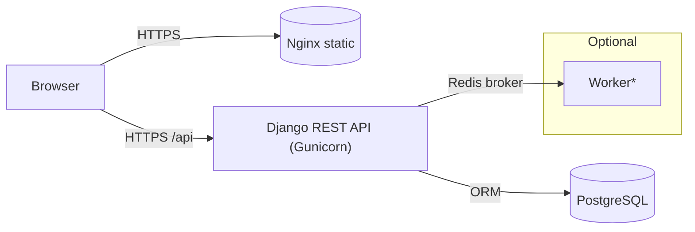

# System Design – Django Task Manager

## 1 Architecture Overview

• **Frontend**: React SPA built with Vite, served as static files by Nginx in production (during local dev, Vite dev-server).  
• **API**: Django + Django REST Framework exposing JWT-protected endpoints.  
• **DB**: PostgreSQL container managed by `docker-compose`.  
• **Background jobs** (bonus): Celery workers using Redis as broker.

## 2 Component Details

| Component | Responsibility |
|-----------|----------------|
| React (Vite) | Authentication views, Task CRUD UI, fetches REST API with Axios. |
| Django | Business logic, ORM, Task CRUD, JWT issuing & validation. |
| DRF | Serializers, viewsets, filtering/search, pagination. |
| PostgreSQL | Relational store for users and tasks. |
| Redis | Celery broker (async notifications). |
| Celery Worker | Executes queued jobs (e.g., send notification). |

## 3 Data Flow – User Creates a Task

1. User submits form in React.  
2. Axios sends `POST /api/tasks/` with JWT Bearer token.  
3. Django authenticates the token, creates the task row in DB.  
4. (Optional) A Celery task is queued to notify the user.  
5. API returns JSON, React shows toast.

## 4 Scaling & Deployment

• **Horizontal API scaling**: stateless Django instances behind a load-balancer; shared DB & Redis.  
• **Front-end**: static files can be served via CDN.  
• **Database**: use managed Postgres with read-replicas if needed.  
• **Cache layer**: Redis for rate-limits and session blacklisting.  
• **Observability**: Add Sentry for error tracking, Prometheus + Grafana for metrics.

## 5 Security Considerations

• HTTPS everywhere.  
• Store JWT secrets & DB credentials in Docker secrets / CI vault.  
• Token lifetimes: short-lived access, refresh rotation.  
• CORS restricted to front-end origin in production.

## 6 Future Improvements

• WebSockets (Django Channels) for real-time task updates.  
• Role-based permissions (staff/admin).  
• Blue-green deployments with zero downtime. 